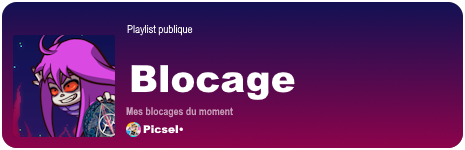
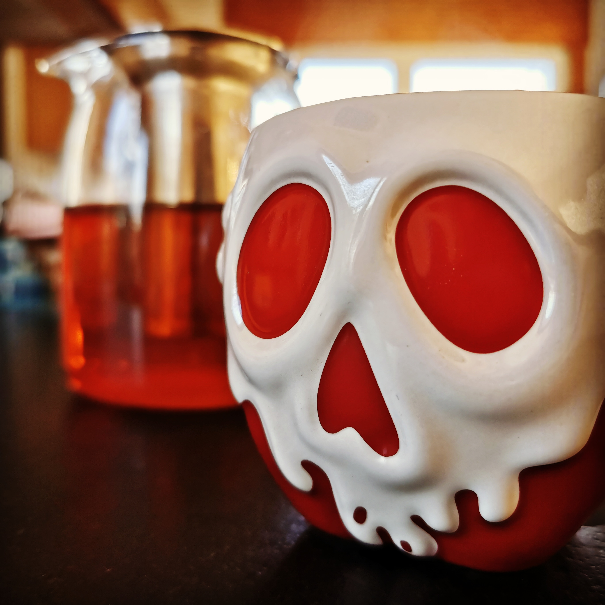

# Picsel │ LassaInora

---

---

  
  

---

.⊹·★˚·˚✦☆⋆˚✫✹·.·✵·⋆★·✦✹·⊹⋆☆⋆˚·⊹⋆·⋆⊹.

 \- 🦊 -  &  - 🍂 -  
 \- 🎵 -  &  - 🔭 -  
 \- 🐍 -  &  - 👾 -  

⋆✦·⊹⋆.˚⋆·✹·⊹★˚★.⊹✫⋆☆✵·.·⋆·☆⋆·˚✦·⊹·˚✹

# Mes passions:
## - Écouter de la musiques:

## - Faire du bruit:

## - Courir partout avec un appareil photo:

    
    
    

---

### Licence
Unless otherwise stated, my projects are under the [GNU General Public License v3](https://raw.githubusercontent.com/LassaInora/LassaInora/refs/heads/main/.github/LICENSE).

---

___

Do you want to support me?

---

